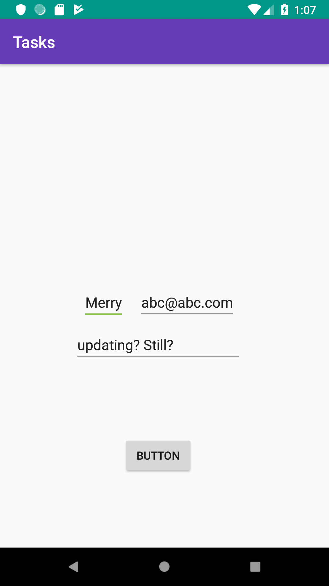
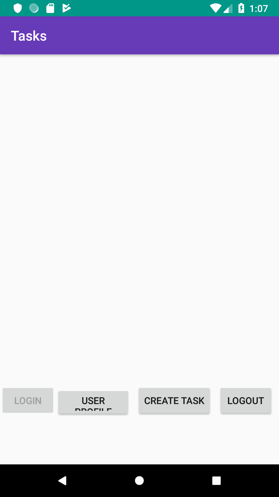

# Tasks

## 6/10/19: Messaging and Device Tokens 

    - Added background messaging capabilities via Firebase. 
    - Began collecting unique device tokens on start up in the main activity and saving them to 
    firebase under the User's profile. 
    - Can edit user name and bio 
    - tasks currently broken as I continue to try and pass an ID on click. 
    
 
 

